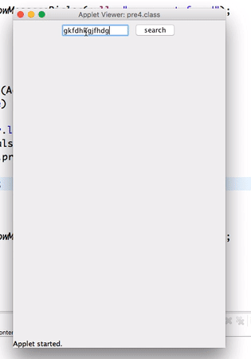
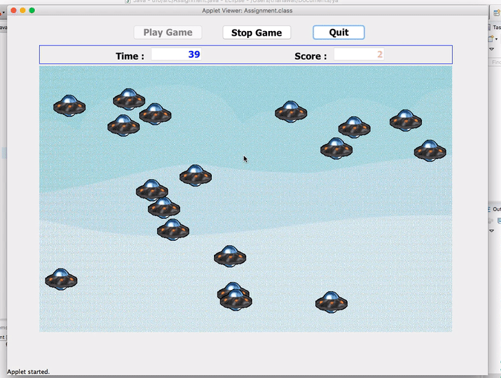

# Pre final java exam
##  ข้อ 1 เกม รถถัง

 > ใช้ปุ่มลูกศรเพื่อเดินรถถัง

[รูปรถถัง กับ BG](https://goo.gl/photos/2CRpaccnpGDcjEjU7)

***
## ข้อ 2 ATM โดยเขียน แยก class

 
##### Class Diagram

> โปรแกรม ATM ด้วยค่าต่างๆ จะเก็บไปที่ class ATM

***

## ข้อ 3 ย้ายตำแหน่งรูปจากการกดปุ่ม

> มี ปุ่ม up , down , left , right สามารถย้ายตำแหน่งรูปได้จากการกดปุ่ม
***
## ข้อ 4 search ข้อมูล จาก array

> ใส่ค่าในช่อง แล้วกด ปุ่ม search โดยสามารถใส่ harry1 ถึง harry7 ได้ เมื่อใส่เสร็จจะแสดง

> รูปหนังสือแต่ละภาค โดยชื่อ harry แต่ละภาคจะเก็บอยู่ใน array

***
## ข้อ 4 ยิง UFO

> มี เวลานับถอยหลัง 40 วิ เมื่อกด โดน UFO  จะได้ คะแนน  1 คะแนนและ UFO นั้นหายไป
